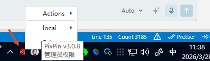

# Node-RED SI Windows 版本

---

## 📖 项目简介

Node-RED SI Windows 是一个专为工业自动化领域设计的 Windows 可执行程序，集成了常用的工业通信协议和数据库连接模块。用户无需预先安装 Node.js 或 Node-RED，即可直接运行，极大简化了部署流程。

---

## ✨ 功能特性

- 🚀 **开箱即用**：无需安装 Node.js 和 Node-RED
- 🏭 **工业协议支持**：集成多种工业通信协议
- 🗄️ **数据库连接**：支持主流数据库连接
- 🎨 **现代化仪表板**：内置功能丰富的仪表板
- 💻 **跨平台兼容**：支持 Windows 7/10/11 (x64)

---

## 📦 集成模块

### 🔧 工业通信协议

| 模块 | 协议 | 说明 |
|------|------|------|
| `node-red-contrib-cip-ethernet-ip` | CIP/Ethernet/IP | Allen-Bradley 设备通信 |
| `node-red-contrib-modbus` | Modbus | 工业标准串行通信协议 |
| `node-red-contrib-opcua` | OPC UA | 开放平台通信统一架构 |
| `node-red-contrib-s7` | 西门子 S7 | 西门子 PLC 通信 |
| `node-red-contrib-pccc` | AB PCCC | Allen-Bradley PCCC 协议 |
| `node-red-contrib-nvl` | NVL | NVL 协议支持 |

### 💾 数据库连接

| 模块 | 数据库 | 说明 |
|------|--------|------|
| `node-red-node-mysql` | MySQL | 开源关系型数据库 |
| `node-red-node-mongodb` | MongoDB | NoSQL 文档数据库 |
| `node-red-node-sqlite` | SQLite | 轻量级嵌入式数据库 |
| `node-red-contrib-mssql-plus` | Microsoft SQL Server | 微软 SQL Server |
| `node-red-contrib-influxdb` | InfluxDB | 时间序列数据库 |

### 🛠️ 其他功能模块

| 模块 | 功能 | 说明 |
|------|------|------|
| `@flowfuse/node-red-dashboard` | 仪表板 | 现代化数据可视化界面 |
| `node-red-node-ping` | 网络检测 | 网络连通性检测工具 |
| `node-red-contrib-aedes` | MQTT Broker | 内置 MQTT 消息代理 |

---

## 📚 示例文件统计

本项目包含丰富的示例文件，帮助用户快速上手各种功能。总计 **182 个示例文件**，分布在以下模块中：

### 📊 示例文件总览

| 模块 | 示例类型 | 文件数量 | 说明 |
|------|---------|---------|------|
| **@node-red/nodes** | 核心节点示例 | 114 | 包含 6 大类 36 个节点的示例 |
| **node-red-contrib-modbus** | Modbus 协议示例 | 62 | 12 个 JSON 流 + 50 个文档和截图 |
| **node-red-contrib-aedes** | MQTT Broker 示例 | 1 | 基础 MQTT 流示例 |
| **node-red-contrib-nvl** | NVL 协议示例 | 3 | 读写、结构、动态属性示例 |
| **node-red-contrib-opcua** | OPC UA 示例 | 1 | 流程图示例 |
| **node-red-contrib-s7** | S7 协议示例 | 1 | 写入测试示例 |

### 🎯 @node-red/nodes 核心节点示例详情

| 分类 | 节点 | 示例数量 | 说明 |
|------|------|---------|------|
| **common** | catch, complete, debug, inject, link, status | 14 | 通用基础节点 |
| **function** | change, delay, exec, function, range, switch, template, trigger | 46 | 功能处理节点 |
| **network** | http, tcp, udp, websocket | 13 | 网络通信节点 |
| **parser** | csv, html, json, xml, yaml | 22 | 数据解析节点 |
| **sequence** | batch, join, sort, split | 9 | 序列处理节点 |
| **storage** | read file, watch, write file | 10 | 文件存储节点 |

---

## 💻 系统要求

| 操作系统 | 版本要求 | 架构 |
|---------|---------|------|
| Windows | 7 Professional 或更高版本 | x64 |
| Windows | 10 | x64 |
| Windows | 11 | x64 |

---

## 🚀 安装与使用

### 📦 使用预编译版本

1. 下载最新发布的可执行文件
2. 解压到目标目录
3. 双击运行 `Node-RED便携版.exe`
4. 等待程序启动完成（系统托盘会出现图标）
5. 访问 Node-RED：
   - **方式一**：浏览器访问 http://localhost:1880
   - **方式二**：右键点击系统托盘图标，选择"Open admin"或"Open Dashboard"

## 🌐 访问界面

| 界面类型 | 访问地址 | 说明 |
|---------|---------|------|
| **Node-RED 编辑器** | `http://localhost:1880/red/admin` | 流程编辑界面 |
| **仪表板界面** | `http://localhost:1880/dashboard` | 数据可视化界面 |

---

## 🤝 开发与贡献

我们欢迎所有形式的贡献！

1. Fork 本项目
2. 创建您的特性分支 (`git checkout -b feature/AmazingFeature`)
3. 提交您的更改 (`git commit -m 'Add some AmazingFeature'`)
4. 推送到分支 (`git push origin feature/AmazingFeature`)
5. 开启一个 Pull Request

---

## 👥 作者

- **科控物联** - 项目维护与改进

---

## 📄 许可证

本项目采用 MIT 许可证 - 查看 [LICENSE](LICENSE) 文件了解详情

---

## 📞 技术支持

如遇到问题，请通过以下方式联系我们：

- 📝 提交 GitHub Issue
- 💬 联系项目维护者 QQ: 2492123056

---

**⭐ 如果这个项目对您有帮助，请给我们一个 Star！**

Made with ❤️ by 科控物联

